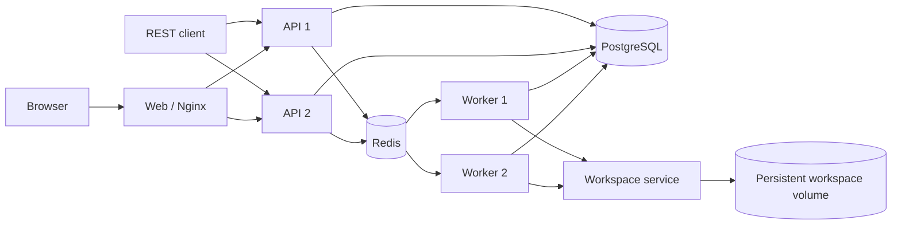

# Distributed Harness MVP

English | [中文](README.zh.md)

This app turns the in-process Harness into a small multi-tenant API–Redis–Worker deployment. PostgreSQL is authoritative for tenants, commands, session headers, and the append-only Harness event log; Redis Streams provides admission scheduling, Redis keys carry renewable session leases and worker heartbeats, and Redis Pub/Sub accelerates cancellation without becoming a source of truth.



Browser users register or log in with a tenant slug, username, and password. The API stores scrypt password hashes and opaque browser-session hashes, then returns an HttpOnly, SameSite cookie that authenticates both HTTP and WebSocket traffic through either API replica. Nginx removes caller-supplied identity headers. Every session, command, and event query includes the authenticated tenant key, and user-facing session operations also include the owner key. Direct ports retain `x-tenant-id` and `x-user-id` as a test/service identity adapter; do not expose those ports to untrusted networks.

## Run and test

From the repository root, start the fixed two-API/two-Worker topology and run the cross-instance test:

```sh
docker compose -f apps/distributed/docker-compose.yml up -d --build
node apps/distributed/scripts/e2e.mjs
docker compose -f apps/distributed/docker-compose.yml exec -T workspace node apps/distributed/scripts/workspace-e2e.mjs
docker compose -f apps/distributed/docker-compose.yml exec -T -e DSH_WEB_URL=http://web api-1 node apps/distributed/scripts/web-e2e.mjs
```

The repository's native Web UI is available at `http://127.0.0.1:20810`. First use **Create tenant** to create a tenant administrator, then sign in with its tenant slug. Registration creates an isolated **Default** workspace; select it and type in the composer to start a conversation. Existing tenants and sessions are migrated into their own defaults. The independent Nginx container serves the built `apps/web` shell and client-plugin graph, load-balances authenticated HTTP RPCs and WebSocket streams over both APIs, and never runs an Agent. API 1 also listens on `http://127.0.0.1:3101`, and API 2 listens on `http://127.0.0.1:3102`. The Web UI supports workspace-backed session listing and creation, durable history, prompts, cancellation, live events, tool rendering, model selection, logout, and tenant-scoped model administration. The deterministic adapter deliberately makes a native `worker_probe` tool call before answering, while the `[workspace-e2e]` probe calls the remote `bash` tool, so tests cover the real Agent Loop, remote tool dispatch, checkpoint persistence, multi-Worker distribution, tenant isolation, cross-API session resume, and the Web–API compatibility protocol without consuming model credits.

One internal Workspace service owns the `workspace-data` volume. A PostgreSQL Workspace id maps deterministically to `/workspaces/<tenant-id>/<workspace-id>`; API and Worker containers do not mount that volume. Workers register RPC proxies for the upstream `read`, `write`, `edit`, `glob`, `grep`, `str_replace_editor`, `bash`, `job_output`, `job_list`, and `job_kill` definitions, and the original upstream implementations execute inside the Workspace container. Foreground and background shell processes, ripgrep searches, and file mutations therefore share the same persistent directory across both Workers and across Workspace-service restarts. Keep `WORKSPACE_SERVICE_TOKEN` equal on Workers and the Workspace service and do not publish port 3200.

Tenant administrators normally configure models from **Model configuration** in the top-right corner. Choose Mock for credit-free testing, or DeepSeek API and enter the default model, base URL, and API key. The key is encrypted with AES-256-GCM in PostgreSQL and is never returned by the API. Each Worker resolves this tenant-scoped snapshot before a command starts, so keys are not placed in process-global environment variables.

The following deployment variables provide initial/fallback defaults:

```dotenv
DISTRIBUTED_LLM_MODE=deepseek
DEFAULT_PROVIDER=deepseek-official
DEFAULT_MODEL=deepseek-v4-flash
DEEPSEEK_API_KEY=replace-me
DEEPSEEK_BASE_URL=https://api.deepseek.com
MODEL_CONFIG_ENCRYPTION_KEY=replace-with-a-long-random-production-secret
```

```sh
docker compose --env-file apps/distributed/.env -f apps/distributed/docker-compose.yml up -d --build
```

New sessions receive the tenant's configured default; existing sessions retain their stored provider and model until selected again. Keep `MODEL_CONFIG_ENCRYPTION_KEY` stable across every API and Worker replica and across restarts, or stored tenant keys cannot be decrypted. Use a secret manager in production rather than the Compose development default.

## API surface

- `POST /auth/register`, `POST /auth/login`, `GET /auth/session`, and `POST /auth/logout` implement browser authentication.
- `GET` and `PUT /admin/model-config` manage the authenticated administrator's tenant model without returning its secret.
- `/api/workspace.*` manages tenant-isolated logical workspaces, manual ordering, session attachment, and archival state.
- `/api/session.*`, `/api/host.describe`, and the `/api/events.mux` and `/api/events.host` WebSockets provide the native Web client compatibility layer.
- `POST /v1/sessions` creates a tenant-owned session.
- `GET /v1/sessions` and `GET /v1/sessions/:id` read owned sessions.
- `POST /v1/sessions/:id/messages` creates an idempotently claimable command and returns `202`.
- `GET /v1/commands/:id` reports command state, Worker identity, final text, and error.
- `GET /v1/sessions/:id/events?afterSeq=N` reads the durable event suffix.
- `GET /v1/sessions/:id/stream?afterSeq=N` streams the same PostgreSQL-backed events over SSE.
- `POST /v1/sessions/:id/cancel` records durable cancellation intent and publishes a best-effort wake-up.
- `GET /healthz` checks the API, PostgreSQL, and Redis connections.

## Delivery and recovery contract

API replicas pump queued PostgreSQL command rows to one Redis consumer-group stream with `FOR UPDATE SKIP LOCKED`. Delivery is at least once: a crash after `XADD` and before the SQL update may duplicate a stream entry, while the atomic command claim prevents duplicate execution. A Worker must hold the Redis lease for `tenant/session` before claiming work, so one session has only one active turn across the cluster. Harness semantic checkpoints durably flush the request prefix before model calls and top-level tool side effects.

A Worker updates both its Redis heartbeat and the active command heartbeat. API pumps return stale running commands to the outbox after two lease windows. Worker startup and request handling use one advisory-locked idempotent migration. Events are served from PostgreSQL, so lost Redis notifications do not lose transcript data.

## Limitations

- The MVP creates a fresh Harness runtime for each command rather than keeping a sticky long-lived Session Actor; this favors simple failover over latency.
- Redis pending entries left by a process crash are not compacted with `XAUTOCLAIM`; SQL recovery creates a fresh schedulable entry, so a long-running deployment needs pending-entry reclamation and stream trimming.
- The stale-command timeout is a coarse lease-based policy. Production deployments need workload-specific deadlines, retry classification, poison-command handling, and a dead-letter workflow.
- Approval prompts, interactive questions, distributed subagent ownership, tenant quotas, audit logging, user invitation/management, password recovery, MFA, and PostgreSQL row-level security remain outside this MVP.
- Shared persistent files and upstream file/search/edit/Bash/job tools are implemented, but repository clone lifecycle, upload/download, a directory browser, attachments and image reading are not yet exposed in the Web UI.
- The single Workspace container is one shared trust boundary. RPC path checks prevent ordinary file/search/editor traversal, but arbitrary Bash commands are intentionally powerful and can inspect the container; this topology provides logical tenant routing, not a hard sandbox for mutually untrusted tenants. Use one container or microVM per trust domain when strong tenant isolation is required.
- Background jobs survive Worker command runtimes but not a Workspace-service restart, and remote job completion does not yet wake an idle Agent automatically; the model can collect known jobs with `job_output` on a later turn.
- The compatibility layer still omits settings and credential mutation, session rename/fork/attachments, queue editing, goals, and subagent operations. Session search, skills, and presets currently return empty catalogs. Unsupported RPCs return an explicit error.
- Browser login and tenant isolation are functional, but production operation still requires TLS, cookie `Secure` policy at ingress, CSRF hardening for broader cross-origin deployments, session revocation administration, rate limits, and external identity-provider integration where required.
- The SSE implementation polls PostgreSQL and is intentionally simple; production fan-out should use committed-event notifications as an acceleration path while retaining sequence-based database catch-up.

## Model Experience

The distribution layer adds no model-visible tenant, Redis, Worker, or Workspace RPC protocol. The model sees the ordinary Harness system prompt, durable conversation history, upstream tool guidance, and registered tool schemas. The Worker-side definitions are transparent RPC proxies; their successful model-facing content comes from the original tool renderer in the Workspace service. The deterministic test adapter calls `worker_probe` or the explicit Workspace probe; official DeepSeek mode receives the same Harness-level context and tool contract. Distribution metadata stays in command rows and infrastructure keys rather than entering prompts, so routing changes do not invalidate the model prefix by themselves.
