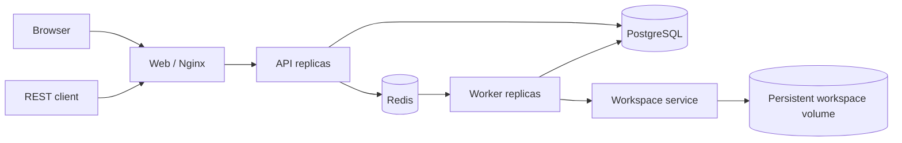

# Distributed Harness

English | [中文](README.zh.md)

This app turns the in-process Harness into a small multi-tenant API–Redis–Worker deployment. PostgreSQL is authoritative for tenants, commands, session headers, and the append-only Harness event log; Redis Streams provides admission scheduling, Redis keys carry renewable session leases and worker heartbeats, and Redis Pub/Sub accelerates cancellation without becoming a source of truth.



Browser users register or log in with a tenant slug, username, and password. The API stores scrypt password hashes and opaque browser-session hashes, then returns an HttpOnly, SameSite cookie that authenticates both HTTP and WebSocket traffic. Nginx removes caller-supplied identity headers. Every session, command, and event query includes the authenticated tenant key, and user-facing session operations also include the owner key. API port 3100 remains internal to the Compose network; port 20810 is the only host ingress.

## Run and test

From the repository root, start one API replica and two Worker replicas, then run the distributed scheduling and upstream-tool parity tests inside the Compose network:

```sh
docker compose -f apps/distributed/docker-compose.yml up -d --build --remove-orphans --scale api=1 --scale worker=2
docker compose -f apps/distributed/docker-compose.yml exec -T -e DSH_API_URL=http://api:3100 -e DSH_WEB_URL=http://web -e DSH_EXPECT_API_REPLICAS=1 -e DSH_EXPECT_WORKER_REPLICAS=2 api node apps/distributed/scripts/e2e.mjs
docker compose -f apps/distributed/docker-compose.yml exec -T api node apps/distributed/scripts/tool-parity-e2e.mjs
docker compose -f apps/distributed/docker-compose.yml exec -T workspace node apps/distributed/scripts/workspace-e2e.mjs
docker compose -f apps/distributed/docker-compose.yml exec -T -e DSH_WEB_URL=http://web api node apps/distributed/scripts/web-e2e.mjs
docker compose -f apps/distributed/docker-compose.yml --profile test up -d openai-mock
docker compose -f apps/distributed/docker-compose.yml exec -T --index 1 -e DSH_API_URL=http://web api node apps/distributed/scripts/openai-e2e.mjs
```

The repository's native Web UI is available at `http://127.0.0.1:20810`. First use **Create tenant** to create a tenant administrator, then sign in with its tenant slug. Registration creates an isolated **Default** workspace; select it and type in the composer to start a conversation. Existing tenants and sessions are migrated into their own defaults. The independent Nginx container serves the built `apps/web` shell and complete upstream Web client composition, discovers all `api` replicas through Compose DNS, forwards authenticated HTTP RPCs and WebSocket streams, and never runs an Agent. The distributed adapters cover durable sessions, settings, models, permissions, goals, interactions, child agents, workflows, Code Mode, dynamic Cordis plugins, context compaction, and the complete shipped preset tool catalogs. Deterministic probes execute the real upstream Agent Loop and tool implementations, so tests cover PostgreSQL checkpoints, API ingress, multi-Worker distribution, tenant isolation, resume, dynamic browser RPCs, and Web compatibility without model credits.

Replica counts are deployment parameters rather than Compose service definitions. Re-run `docker compose -f apps/distributed/docker-compose.yml up -d --scale api=3 --scale worker=4` to simulate Kubernetes Deployment scaling. Container hostnames produce unique API and Worker instance ids, Nginx re-resolves the `api` service name, and the Redis consumer group assigns commands across live Workers. Keep at least one API and one Worker replica; scaling the Workspace service is unsupported because it exclusively owns the shared volume and long-lived background-job registry.

One internal Workspace service owns the `workspace-data` volume and long-lived upstream Agent runtimes. A PostgreSQL Workspace id maps deterministically to `/workspaces/<tenant-id>/<workspace-id>`; API and Worker containers do not mount that volume. Queue Workers delegate complete commands to retained Agent handles in Workspace rather than rebuilding a runtime or proxying a selected tool list. The official preset composition therefore owns schemas, prompts, renderers, Code Mode, child-agent and workflow lifecycles, Cordis plugins, foreground and background commands, searches, and file mutations. Keep `WORKSPACE_SERVICE_TOKEN` equal on Workers and Workspace and do not publish port 3200.

The distributed adapters are Cordis plugins rather than forks of upstream tools. Workspace boots the upstream `base` and `web-app` Host compositions and official `standard`, `code`, `minimal`, and `cordis` presets. Standard includes file, Bash, jobs, skills, goals, planning, todo, Web search, delegation, workflow, Ralph, and interaction tools; Code Mode presents those capabilities through `run_code`; minimal keeps its persistent-terminal `bash` and `str_replace_editor`; Cordis adds seven dynamic-plugin tools. Workspace skills remain available through `skill`, PostgreSQL-authored tenant presets are materialized into the official user roster before mounting, and the Web host's session-query service is retained. MCP and LSP remain upstream opt-in extensions that can be mounted by a tenant preset; they are not part of the shipped upstream standard preset. See the [Web composition decision](../../.agents/notes/implemented/architecture/2026-08-14-distributed-upstream-composition.md) and [runtime parity decision](../../.agents/notes/implemented/architecture/2026-08-14-distributed-runtime-parity.md).

Tenant administrators configure models from **Settings → Models**. Choose Mock for credit-free testing, DeepSeek API, or OpenAI-compatible Chat Completions, then enter the default model, base URL, and optional API key. The upstream settings view is the single UI owner; `GET` and `PUT /admin/model-config` remain available for automation. OpenAI-compatible mode accepts a base such as `https://api.openai.com/v1` or a complete `/chat/completions` URL and normalizes the latter. Settings and encrypted credentials are tenant scoped. Workspace resolves them when it boots an execution context; updates retire idle contexts immediately and active contexts after their command finishes, so the next command uses the new configuration without process-global tenant keys.

OpenAI-compatible mode mounts the upstream `@deepseek-ai/dsh-llm-pi-ai` Cordis plugin under the `openai-compatible` provider route with the `openai-completions` protocol. Its streaming text, native tool calls, usage, finish reasons, cancellation, and error conversion therefore use the upstream adapter rather than a distributed-app protocol fork. The configured model id is passed through to the endpoint; local gateways that do not require authentication may leave the key empty.

The following deployment variables provide initial/fallback defaults:

```dotenv
DISTRIBUTED_LLM_MODE=deepseek
DEFAULT_PROVIDER=deepseek-official
DEFAULT_MODEL=deepseek-v4-flash
DEEPSEEK_API_KEY=replace-me
DEEPSEEK_BASE_URL=https://api.deepseek.com
OPENAI_API_KEY=replace-me
OPENAI_BASE_URL=https://api.openai.com/v1
MODEL_CONFIG_ENCRYPTION_KEY=replace-with-a-long-random-production-secret
```

```sh
docker compose --env-file apps/distributed/.env -f apps/distributed/docker-compose.yml up -d --build --scale api=2 --scale worker=2
```

New sessions receive the tenant's configured default; existing sessions retain their stored provider and model until selected again. Keep `MODEL_CONFIG_ENCRYPTION_KEY` stable across the API and all Workers and across restarts, or stored tenant keys cannot be decrypted. Use a secret manager in production rather than the Compose development default.

## API surface

- `POST /auth/register`, `POST /auth/login`, `GET /auth/session`, and `POST /auth/logout` implement browser authentication.
- `GET` and `PUT /admin/model-config` manage the authenticated administrator's tenant model without returning its secret.
- `/api/workspace.*` manages tenant-isolated logical workspaces, manual ordering, session attachment, and archival state.
- `/api/session.*`, `/api/host.describe`, and the `/api/events.mux` and `/api/events.host` WebSockets provide the native Web client compatibility layer.
- `/api/settings.*` and `/api/credentials.*` provide revision-fenced tenant settings and write-only encrypted credentials.
- `/api/commands/*`, `/api/goals/*`, `/api/agentPreset.*`, `/api/messageFeedback/*`, `/api/skill.list`, `/api/subagent.*`, `/api/pluginInventory/list`, and `/api/dynamicCordisRunner/*` back the corresponding upstream Web plugins.
- `POST /v1/sessions` creates a tenant-owned session.
- `GET /v1/sessions` and `GET /v1/sessions/:id` read owned sessions.
- `POST /v1/sessions/:id/messages` creates an idempotently claimable command and returns `202`.
- `GET /v1/commands/:id` reports command state, Worker identity, final text, and error.
- `GET /v1/sessions/:id/events?afterSeq=N` reads the durable event suffix.
- `GET /v1/sessions/:id/stream?afterSeq=N` streams the same PostgreSQL-backed events over SSE.
- `POST /v1/sessions/:id/cancel` records durable cancellation intent and publishes a best-effort wake-up.
- `GET /healthz` checks the API, PostgreSQL, and Redis connections.

## Delivery and recovery contract

The API pumps queued PostgreSQL command rows to one Redis consumer-group stream with `FOR UPDATE SKIP LOCKED`. Delivery is at least once: a crash after `XADD` and before the SQL update may duplicate a stream entry, while the atomic command claim prevents duplicate execution. A Worker must hold the Redis lease for `tenant/session` before claiming work, so one session has only one active turn across the cluster. Harness semantic checkpoints durably flush the request prefix before model calls and top-level tool side effects.

A Worker updates both its Redis heartbeat and the active command heartbeat. API pumps return stale running commands to the outbox after two lease windows. Worker startup and request handling use one advisory-locked idempotent migration. Events are served from PostgreSQL, so lost Redis notifications do not lose transcript data.

## Limitations

- The singleton Workspace retains Agent handles, jobs, continuable children, workflows, and dynamic Cordis state; its restart restores durable sessions from PostgreSQL but ends process-local work.
- Redis pending entries left by a process crash are not compacted with `XAUTOCLAIM`; SQL recovery creates a fresh schedulable entry, so a long-running deployment needs pending-entry reclamation and stream trimming.
- The stale-command timeout is a coarse lease-based policy. Production deployments need workload-specific deadlines, retry classification, poison-command handling, and a dead-letter workflow.
- Tenant quotas, audit logging, user invitation/management, password recovery, MFA, and PostgreSQL row-level security remain production work. MCP and LSP are upstream opt-in composition packages rather than missing default tools; using them requires a tenant preset and corresponding external server configuration.
- Shared persistent files, workspace skills, upstream file/search/edit/Bash/job tools, directory browsing, session rename and fork, and attachment metadata are implemented. Repository clone lifecycle, browser upload/download, image-content delivery to models, and deliverable storage still need distributed ownership.
- The single Workspace container is one shared trust boundary. RPC path checks prevent ordinary file/search/editor traversal, but arbitrary Bash commands are intentionally powerful and can inspect the container; this topology provides logical tenant routing, not a hard sandbox for mutually untrusted tenants. Use one container or microVM per trust domain when strong tenant isolation is required.
- Background jobs survive Worker changes but not a Workspace-service restart. Queue editing still does not steer a command already claimed through Redis; cancel or let that turn finish before an API-owned mode change.
- Browser login and tenant isolation are functional, but production operation still requires TLS, cookie `Secure` policy at ingress, CSRF hardening for broader cross-origin deployments, session revocation administration, rate limits, and external identity-provider integration where required.
- The SSE implementation polls PostgreSQL and is intentionally simple; production fan-out should use committed-event notifications as an acceleration path while retaining sequence-based database catch-up.

## Model Experience

The distribution layer adds no model-visible tenant, Redis, Worker, or Workspace RPC protocol. Model requests and every tool call run in the upstream Workspace composition; Workers never substitute schemas or model-visible results. Official DeepSeek and OpenAI-compatible modes receive the same Harness context and preset contract. Distribution metadata stays in command rows and infrastructure keys rather than entering prompts, so routing changes do not invalidate the model prefix by themselves.
