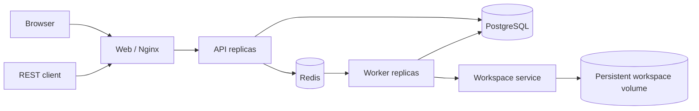

# 分布式 Harness

[English](README.md) | 中文

这个应用把进程内 Harness 改造成一个小型多租户 API–Redis–Worker 部署。PostgreSQL 是租户、命令、会话头和 Harness 追加式事件日志的权威数据源；Redis Streams 负责准入调度，Redis 键承载可续租的会话租约和 Worker 心跳，Redis Pub/Sub 只用于加速取消通知，不作为事实来源。



浏览器用户使用租户标识、用户名和密码注册或登录。API 保存 scrypt 密码哈希与不透明浏览器会话哈希，并返回用于认证 HTTP 和 WebSocket 流量的 HttpOnly、SameSite Cookie。Nginx 会清除调用方伪造的身份请求头。每条会话、命令和事件查询都包含已认证租户键，面向用户的会话操作还包含所有者键。API 的 3100 端口仅在 Compose 网络内可见，20810 是唯一宿主机入口。

## 运行与测试

在仓库根目录启动一个 API 副本和两个 Worker 副本，然后在 Compose 网络内运行分布式调度与上游工具一致性测试：

```sh
docker compose -f apps/distributed/docker-compose.yml up -d --build --remove-orphans --scale api=1 --scale worker=2
docker compose -f apps/distributed/docker-compose.yml exec -T -e DSH_API_URL=http://api:3100 -e DSH_WEB_URL=http://web -e DSH_EXPECT_API_REPLICAS=1 -e DSH_EXPECT_WORKER_REPLICAS=2 api node apps/distributed/scripts/e2e.mjs
docker compose -f apps/distributed/docker-compose.yml exec -T api node apps/distributed/scripts/tool-parity-e2e.mjs
docker compose -f apps/distributed/docker-compose.yml exec -T workspace node apps/distributed/scripts/workspace-e2e.mjs
docker compose -f apps/distributed/docker-compose.yml exec -T -e DSH_WEB_URL=http://web api node apps/distributed/scripts/web-e2e.mjs
docker compose -f apps/distributed/docker-compose.yml --profile test up -d openai-mock
docker compose -f apps/distributed/docker-compose.yml exec -T --index 1 -e DSH_API_URL=http://web api node apps/distributed/scripts/openai-e2e.mjs
```

仓库原生 Web UI 位于 `http://127.0.0.1:20810`。首次使用时点击“创建租户”创建租户管理员，然后用租户标识登录。注册会创建一个隔离的“Default”工作区；选择它后即可在输入框开始对话。已有租户和会话也会迁移到各自的默认工作区。独立 Nginx 容器负责提供构建后的 `apps/web` shell 与完整上游 Web 客户端组合，通过 Compose DNS 发现全部 `api` 副本，并转发经过认证的 HTTP RPC 与 WebSocket 流量；Web 容器本身不运行 Agent。分布式适配器覆盖持久会话、设置、模型、权限、目标、交互、子 Agent、工作流、Code Mode、动态 Cordis 插件、上下文压缩和所有上游已发布预设的完整工具目录。确定性探针会执行真实的上游 Agent Loop 与工具实现，因此无需消耗模型额度，也能覆盖 PostgreSQL 检查点、API 入口、多 Worker 分配、租户隔离、会话恢复、动态浏览器 RPC 和 Web 兼容协议。

副本数是部署参数，不再写死为 Compose 服务。重新执行 `docker compose -f apps/distributed/docker-compose.yml up -d --scale api=3 --scale worker=4` 即可模拟 Kubernetes Deployment 扩缩容。容器 hostname 会生成唯一的 API 与 Worker 实例 ID，Nginx 会重新解析 `api` 服务名，Redis consumer group 会把命令分配给存活 Worker。至少保留一个 API 与一个 Worker；Workspace 服务独占共享卷和长生命周期后台任务注册表，因此不支持横向扩展。

一个内部 Workspace 服务独占 `workspace-data` 卷并承载长生命周期的上游 Agent 运行时。PostgreSQL Workspace id 会确定性映射为 `/workspaces/<tenant-id>/<workspace-id>`；API 和 Worker 容器都不挂载该卷。队列 Worker 把完整命令委托给 Workspace 中保留的 Agent handle，而不是重新构建运行时或代理一份挑选过的工具列表。因此 schema、提示、渲染器、Code Mode、子 Agent 与工作流生命周期、Cordis 插件、前后台命令、搜索和文件修改均由官方预设组合拥有。必须让 Worker 与 Workspace 服务使用相同的 `WORKSPACE_SERVICE_TOKEN`，且不要对外发布 3200 端口。

分布式适配器是 Cordis 插件，而不是上游工具的 fork。Workspace 启动上游 `base`、`web-app` Host 组合以及官方 `standard`、`code`、`minimal`、`cordis` 预设。standard 包含文件、Bash、后台任务、skill、目标、计划、todo、联网搜索、委派、工作流、Ralph 与交互工具；Code Mode 通过 `run_code` 展示同一组能力；minimal 保留基于持久终端的 `bash` 与 `str_replace_editor`；Cordis 增加七个动态插件工具。工作区 skill 仍可通过 `skill` 使用，PostgreSQL 中的租户预设会在挂载前写入官方用户预设目录，Web Host 的会话查询服务也继续参与组合。MCP 与 LSP 是上游选择启用的扩展，可通过租户预设挂载，但不属于上游发布的 standard 默认目录。参见 [Web 组合决策](../../.agents/notes/implemented/architecture/2026-08-14-distributed-upstream-composition.md) 与[运行时一致性决策](../../.agents/notes/implemented/architecture/2026-08-14-distributed-runtime-parity.md)。

租户管理员通过“设置 → 模型”完成模型配置。可以选择 Mock 做无额度测试，也可以选择 DeepSeek API 或 OpenAI-compatible Chat Completions，然后填写默认模型、Base URL 和可选的 API Key。上游设置页是唯一的 UI 所有者；`GET` 与 `PUT /admin/model-config` 仍为自动化保留。OpenAI-compatible 模式既接受 `https://api.openai.com/v1` 这样的根地址，也接受完整的 `/chat/completions` 地址；后者会被规范化。设置与加密凭据均按租户隔离。Workspace 在启动执行上下文时解析配置；更新会立即回收空闲上下文，并在活跃命令结束后回收对应上下文，因此下一条命令会使用新配置，且不存在进程全局的租户密钥。

OpenAI-compatible 模式会把上游 `@deepseek-ai/dsh-llm-pi-ai` Cordis 插件挂载到 `openai-compatible` provider 路由，并固定使用 `openai-completions` 协议。因此流式文本、原生工具调用、用量、结束原因、取消和错误转换均复用上游适配器，而不是在分布式应用中 fork 一份协议实现。配置的模型 id 会原样传给端点；不要求认证的本地网关可以将密钥留空。

以下部署变量提供初始值或回退默认值：

```dotenv
DISTRIBUTED_LLM_MODE=deepseek
DEFAULT_PROVIDER=deepseek-official
DEFAULT_MODEL=deepseek-v4-flash
DEEPSEEK_API_KEY=replace-me
DEEPSEEK_BASE_URL=https://api.deepseek.com
OPENAI_API_KEY=replace-me
OPENAI_BASE_URL=https://api.openai.com/v1
MODEL_CONFIG_ENCRYPTION_KEY=replace-with-a-long-random-production-secret
```

```sh
docker compose --env-file apps/distributed/.env -f apps/distributed/docker-compose.yml up -d --build --scale api=2 --scale worker=2
```

新会话使用所属租户的默认值；已有会话继续保留数据库中存储的提供方和模型，直到重新选择。API、所有 Worker 以及服务重启之间必须保持 `MODEL_CONFIG_ENCRYPTION_KEY` 一致，否则已保存的租户密钥无法解密。生产环境应使用密钥管理服务，而不是 Compose 的开发默认值。

## API 范围

- `POST /auth/register`、`POST /auth/login`、`GET /auth/session` 和 `POST /auth/logout` 实现浏览器认证。
- `GET` 与 `PUT /admin/model-config` 管理当前管理员所属租户的模型，且不会返回密钥。
- `/api/workspace.*` 管理租户隔离的逻辑工作区、手动排序、会话归属和归档状态。
- `/api/session.*`、`/api/host.describe` 以及 `/api/events.mux`、`/api/events.host` WebSocket 构成原生 Web 客户端兼容层。
- `/api/settings.*` 与 `/api/credentials.*` 提供受修订号约束的租户设置和只写加密凭据。
- `/api/commands/*`、`/api/goals/*`、`/api/agentPreset.*`、`/api/messageFeedback/*`、`/api/skill.list`、`/api/subagent.*`、`/api/pluginInventory/list` 与 `/api/dynamicCordisRunner/*` 支撑相应的上游 Web 插件。
- `POST /v1/sessions` 创建租户所有的会话。
- `GET /v1/sessions` 和 `GET /v1/sessions/:id` 读取当前用户所有的会话。
- `POST /v1/sessions/:id/messages` 创建可幂等认领的命令并返回 `202`。
- `GET /v1/commands/:id` 返回命令状态、Worker 身份、最终文本和错误。
- `GET /v1/sessions/:id/events?afterSeq=N` 读取持久事件后缀。
- `GET /v1/sessions/:id/stream?afterSeq=N` 通过 SSE 推送同一份 PostgreSQL 事件。
- `POST /v1/sessions/:id/cancel` 记录持久取消意图并发布尽力而为的唤醒通知。
- `GET /healthz` 检查 API、PostgreSQL 和 Redis 连接。

## 投递与恢复契约

API 使用 `FOR UPDATE SKIP LOCKED` 把排队中的 PostgreSQL 命令行泵入一个 Redis 消费组 Stream。投递是至少一次：在 `XADD` 之后、SQL 更新之前崩溃可能产生重复 Stream 项，而原子命令认领会阻止重复执行。Worker 必须先持有 `tenant/session` 的 Redis 租约才能认领工作，因此集群中同一会话最多只有一个活跃轮次。Harness 语义检查点会在模型调用和顶层工具副作用之前持久刷写请求前缀。

Worker 同时更新 Redis Worker 心跳和活跃命令心跳。API 泵会在两个租约窗口后把陈旧运行命令放回 outbox。Worker 启动和请求处理共用受 advisory lock 保护的幂等迁移。事件始终从 PostgreSQL 提供，因此 Redis 通知丢失不会导致 transcript 丢失。

## 限制

- 单例 Workspace 会保留 Agent handle、后台任务、可继续子 Agent、工作流与动态 Cordis 状态；重启时从 PostgreSQL 恢复持久会话，但会结束进程本地工作。
- 进程崩溃遗留的 Redis pending 项尚未通过 `XAUTOCLAIM` 压缩；SQL 恢复会创建新的可调度项，因此长时间运行的部署还需要 pending 回收和 Stream 裁剪。
- 陈旧命令超时是粗粒度的租约策略。生产部署需要按工作负载配置截止时间、重试分类、毒性命令处理和死信流程。
- 租户配额、审计日志、用户邀请/管理、密码找回、MFA 和 PostgreSQL 行级安全仍属于生产化工作。MCP 与 LSP 是上游选择启用的组合包，而不是缺失的默认工具；使用它们需要租户预设和相应外部服务配置。
- 共享持久文件、工作区 skill、上游文件/搜索/编辑/Bash/后台任务工具、目录浏览、会话重命名与 fork 以及附件元数据已经实现。仓库克隆生命周期、浏览器上传下载、向模型传递图片内容和交付物存储仍需要分布式所有权。
- 单个 Workspace 容器是一个共享信任边界。RPC 路径检查可以阻止普通文件/搜索/编辑器路径穿越，但任意 Bash 命令刻意保留了强能力并可检查容器；该拓扑提供逻辑租户路由，而不是面向互不信任租户的硬沙箱。需要强租户隔离时，应按信任域使用独立容器或微虚拟机。
- 后台任务可跨 Worker 变更继续存在，但不能跨 Workspace 服务重启。队列编辑仍不能 steering 已由 Redis 认领的命令；必须取消或等待该轮结束，再执行 API 所有的模式切换。
- 浏览器登录和租户隔离已经可用，但生产运维仍需 TLS、入口 Cookie `Secure` 策略、更广泛跨域场景下的 CSRF 加固、会话撤销管理、限流，以及按需接入外部身份提供方。
- SSE 实现会轮询 PostgreSQL，保持刻意简化；生产 fan-out 应把已提交事件通知作为加速路径，同时保留按序列号从数据库追赶的能力。

## 模型体验

分布式层不会向模型暴露租户、Redis、Worker 或 Workspace RPC 协议。模型请求与每一次工具调用都在上游 Workspace 组合中运行；Worker 不会替换 schema 或模型可见结果。官方 DeepSeek 与 OpenAI-compatible 模式接收相同的 Harness 上下文与预设契约。分布式元数据留在命令行和基础设施键中，不进入提示，因此单纯改变路由不会使模型前缀失效。
