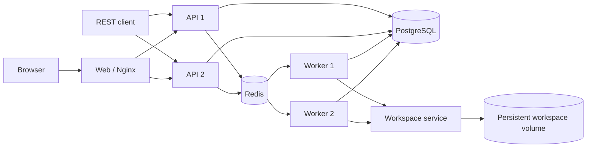

# 分布式 Harness

[English](README.md) | 中文

这个应用把进程内 Harness 改造成一个小型多租户 API–Redis–Worker 部署。PostgreSQL 是租户、命令、会话头和 Harness 追加式事件日志的权威数据源；Redis Streams 负责准入调度，Redis 键承载可续租的会话租约和 Worker 心跳，Redis Pub/Sub 只用于加速取消通知，不作为事实来源。



浏览器用户使用租户标识、用户名和密码注册或登录。API 保存 scrypt 密码哈希与不透明浏览器会话哈希，并返回 HttpOnly、SameSite Cookie；该 Cookie 可通过任一 API 副本同时认证 HTTP 和 WebSocket 流量。Nginx 会清除调用方伪造的身份请求头。每条会话、命令和事件查询都包含已认证租户键，面向用户的会话操作还包含所有者键。直连端口仍保留 `x-tenant-id` 和 `x-user-id` 作为测试/服务身份适配器，不应暴露给不可信网络。

## 运行与测试

在仓库根目录启动固定的双 API、双 Worker 拓扑，并运行跨实例测试：

```sh
docker compose -f apps/distributed/docker-compose.yml up -d --build
node apps/distributed/scripts/e2e.mjs
docker compose -f apps/distributed/docker-compose.yml exec -T workspace node apps/distributed/scripts/workspace-e2e.mjs
docker compose -f apps/distributed/docker-compose.yml exec -T -e DSH_WEB_URL=http://web api-1 node apps/distributed/scripts/web-e2e.mjs
docker compose -f apps/distributed/docker-compose.yml --profile test up -d openai-mock
node apps/distributed/scripts/openai-e2e.mjs
```

仓库原生 Web UI 位于 `http://127.0.0.1:20810`。首次使用时点击“创建租户”创建租户管理员，然后用租户标识登录。注册会创建一个隔离的“Default”工作区；选择它后即可在输入框开始对话。已有租户和会话也会迁移到各自的默认工作区。独立 Nginx 容器负责提供构建后的 `apps/web` shell 与完整上游 Web 客户端组合，并把经过认证的 HTTP RPC 与 WebSocket 流量负载均衡到两个 API；Web 容器本身不运行 agent。API 1 还监听 `http://127.0.0.1:3101`，API 2 监听 `http://127.0.0.1:3102`。可工作的分布式适配器覆盖工作区与会话管理、持久历史、提示词与取消、实时事件、工具、设置、加密凭据、模型选择、agent 预设、权限与计划模式、目标、消息反馈、skill 和上下文压缩。默认确定性适配器会在回答前刻意发起一次原生 `worker_probe` 工具调用，而 `[workspace-e2e]` 探针会调用远程 `bash` 工具，因此测试无需消耗模型额度，也能覆盖真实 agent loop、远程工具派发、检查点持久化、多 Worker 分配、租户隔离、跨 API 会话恢复和 Web–API 兼容协议。

一个内部 Workspace 服务独占 `workspace-data` 卷。PostgreSQL Workspace id 会确定性映射为 `/workspaces/<tenant-id>/<workspace-id>`；API 和 Worker 容器都不挂载该卷。Worker 会为上游 `read`、`write`、`edit`、`glob`、`grep`、`str_replace_editor`、`bash`、`job_output`、`job_list` 和 `job_kill` 定义注册 RPC 代理，而原始上游实现在 Workspace 容器内执行。因此前台与后台 shell 进程、ripgrep 搜索和文件修改可在两个 Worker 之间共享同一个持久目录，并能跨 Workspace 服务重启保留。必须让 Worker 与 Workspace 服务使用相同的 `WORKSPACE_SERVICE_TOKEN`，且不要对外发布 3200 端口。

分布式适配器是 Cordis 插件，而不是上游工具的 fork。Workspace 运行时插件在一个工作区作用域生命周期内组合原始文件系统、搜索、编辑器、Bash 和后台任务提供方；Worker 适配器拥有远程目录监听器和代理注册。每个非 minimal 命令运行时都会挂载上游 token 计量、基础压缩、工具结果裁剪、计划模式、`todo_write` 工具和重复调用提醒。工作区内的 `.dsh/skills` 与 `.agents/skills` 文件会进入目录，并可通过面向模型的 `skill` 工具加载。Web 组装器从上游 `base` 与 `web-app` Cordis 组合推导完整客户端清单，不维护分布式白名单。[架构决策](../../.agents/notes/implemented/architecture/2026-08-14-distributed-upstream-composition.md) 区分了这种客户端组合一致性和仍需分布式所有者的高级能力。

租户管理员通常通过“设置 → 模型”或分布式“模型配置”快捷入口完成设置。可以选择 Mock 做无额度测试，也可以选择 DeepSeek API 或 OpenAI-compatible Chat Completions，然后填写默认模型、Base URL 和可选的 API Key。OpenAI-compatible 模式既接受 `https://api.openai.com/v1` 这样的根地址，也接受完整的 `/chat/completions` 地址；后者会被规范化为根地址。通用 UI 设置、模型设置、凭据引用与 agent 预设默认值均按租户隔离，修订号通过比较并设置方式写入。凭据值使用 AES-256-GCM 加密后存入 PostgreSQL，接口永不回显。每个 Worker 会在命令开始前解析对应租户的配置快照，因此不会通过进程全局环境变量串用密钥。

OpenAI-compatible 模式会把上游 `@deepseek-ai/dsh-llm-pi-ai` Cordis 插件挂载到 `openai-compatible` provider 路由，并固定使用 `openai-completions` 协议。因此流式文本、原生工具调用、用量、结束原因、取消和错误转换均复用上游适配器，而不是在分布式应用中 fork 一份协议实现。配置的模型 id 会原样传给端点；不要求认证的本地网关可以将密钥留空。

以下部署变量提供初始值或回退默认值：

```dotenv
DISTRIBUTED_LLM_MODE=deepseek
DEFAULT_PROVIDER=deepseek-official
DEFAULT_MODEL=deepseek-v4-flash
DEEPSEEK_API_KEY=replace-me
DEEPSEEK_BASE_URL=https://api.deepseek.com
OPENAI_API_KEY=replace-me
OPENAI_BASE_URL=https://api.openai.com/v1
MODEL_CONFIG_ENCRYPTION_KEY=replace-with-a-long-random-production-secret
```

```sh
docker compose --env-file apps/distributed/.env -f apps/distributed/docker-compose.yml up -d --build
```

新会话使用所属租户的默认值；已有会话继续保留数据库中存储的提供方和模型，直到重新选择。所有 API 与 Worker 副本以及服务重启之间必须保持 `MODEL_CONFIG_ENCRYPTION_KEY` 一致，否则已保存的租户密钥无法解密。生产环境应使用密钥管理服务，而不是 Compose 的开发默认值。

## API 范围

- `POST /auth/register`、`POST /auth/login`、`GET /auth/session` 和 `POST /auth/logout` 实现浏览器认证。
- `GET` 与 `PUT /admin/model-config` 管理当前管理员所属租户的模型，且不会返回密钥。
- `/api/workspace.*` 管理租户隔离的逻辑工作区、手动排序、会话归属和归档状态。
- `/api/session.*`、`/api/host.describe` 以及 `/api/events.mux`、`/api/events.host` WebSocket 构成原生 Web 客户端兼容层。
- `/api/settings.*` 与 `/api/credentials.*` 提供受修订号约束的租户设置和只写加密凭据。
- `/api/commands/*`、`/api/goals/*`、`/api/agentPreset.*`、`/api/messageFeedback/*`、`/api/skill.list` 与 `/api/pluginInventory/list` 支撑相应的上游 Web 插件。
- `POST /v1/sessions` 创建租户所有的会话。
- `GET /v1/sessions` 和 `GET /v1/sessions/:id` 读取当前用户所有的会话。
- `POST /v1/sessions/:id/messages` 创建可幂等认领的命令并返回 `202`。
- `GET /v1/commands/:id` 返回命令状态、Worker 身份、最终文本和错误。
- `GET /v1/sessions/:id/events?afterSeq=N` 读取持久事件后缀。
- `GET /v1/sessions/:id/stream?afterSeq=N` 通过 SSE 推送同一份 PostgreSQL 事件。
- `POST /v1/sessions/:id/cancel` 记录持久取消意图并发布尽力而为的唤醒通知。
- `GET /healthz` 检查 API、PostgreSQL 和 Redis 连接。

## 投递与恢复契约

API 副本使用 `FOR UPDATE SKIP LOCKED` 把排队中的 PostgreSQL 命令行泵入一个 Redis 消费组 Stream。投递是至少一次：在 `XADD` 之后、SQL 更新之前崩溃可能产生重复 Stream 项，而原子命令认领会阻止重复执行。Worker 必须先持有 `tenant/session` 的 Redis 租约才能认领工作，因此集群中同一会话最多只有一个活跃轮次。Harness 语义检查点会在模型调用和顶层工具副作用之前持久刷写请求前缀。

Worker 同时更新 Redis Worker 心跳和活跃命令心跳。API 泵会在两个租约窗口后把陈旧运行命令放回 outbox。Worker 启动和请求处理共用受 advisory lock 保护的幂等迁移。事件始终从 PostgreSQL 提供，因此 Redis 通知丢失不会导致 transcript 丢失。

## 限制

- MVP 为每条命令创建新的 Harness 运行时，没有保留粘性的长生命周期 Session Actor；它优先保证故障转移简单，而不是最低延迟。
- 进程崩溃遗留的 Redis pending 项尚未通过 `XAUTOCLAIM` 压缩；SQL 恢复会创建新的可调度项，因此长时间运行的部署还需要 pending 回收和 Stream 裁剪。
- 陈旧命令超时是粗粒度的租约策略。生产部署需要按工作负载配置截止时间、重试分类、毒性命令处理和死信流程。
- 交互式审批与提问、分布式 subagent 与工作流所有权、MCP 服务生命周期、实时 Cordis 插件重配置、Web 搜索、LSP、租户配额、审计日志、用户邀请/管理、密码找回、MFA 和 PostgreSQL 行级安全尚未由分布式适配器实现。其上游客户端视图可能展示持久事件或空状态；不支持的修改会明确失败。
- 共享持久文件、工作区 skill、上游文件/搜索/编辑/Bash/后台任务工具、目录浏览、会话重命名与 fork 以及附件元数据已经实现。仓库克隆生命周期、浏览器上传下载、向模型传递图片内容和交付物存储仍需要分布式所有权。
- 单个 Workspace 容器是一个共享信任边界。RPC 路径检查可以阻止普通文件/搜索/编辑器路径穿越，但任意 Bash 命令刻意保留了强能力并可检查容器；该拓扑提供逻辑租户路由，而不是面向互不信任租户的硬沙箱。需要强租户隔离时，应按信任域使用独立容器或微虚拟机。
- 后台任务可跨 Worker 命令运行时继续存在，但不能跨 Workspace 服务重启；远程任务完成也尚不能自动唤醒空闲 Agent，模型可以在后续轮次通过 `job_output` 收集已知任务。
- 队列编辑接受上游 RPC，但尚不能对每条命令创建的实时 agent actor 进行 steering；必须等运行中的轮次结束或将其取消，API 才能写入模式切换等自身拥有的会话事件。subagent 历史/提示/中断操作仍不受支持，在分布式子会话存在之前其目录会正确保持为空。
- 浏览器登录和租户隔离已经可用，但生产运维仍需 TLS、入口 Cookie `Secure` 策略、更广泛跨域场景下的 CSRF 加固、会话撤销管理、限流，以及按需接入外部身份提供方。
- SSE 实现会轮询 PostgreSQL，保持刻意简化；生产 fan-out 应把已提交事件通知作为加速路径，同时保留按序列号从数据库追赶的能力。

## 模型体验

分布式层不会向模型暴露租户、Redis、Worker 或 Workspace RPC 协议。模型仍然只看到普通 Harness 系统提示、持久会话历史、上游工具指引和已注册工具 schema。Worker 侧定义是透明 RPC 代理，其成功调用的模型可见内容来自 Workspace 服务中的原始工具渲染器。确定性测试适配器调用 `worker_probe` 或显式 Workspace 探针；官方 DeepSeek 与 OpenAI-compatible 模式接收同一套 Harness 上下文与工具契约。分布式元数据留在命令行和基础设施键中，不进入提示，因此单纯改变路由不会使模型前缀失效。
