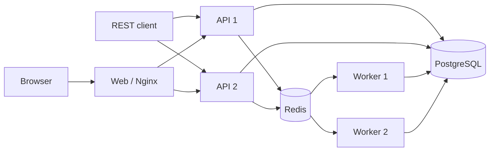

# 分布式 Harness MVP

[English](README.md) | 中文

这个应用把进程内 Harness 改造成一个小型多租户 API–Redis–Worker 部署。PostgreSQL 是租户、命令、会话头和 Harness 追加式事件日志的权威数据源；Redis Streams 负责准入调度，Redis 键承载可续租的会话租约和 Worker 心跳，Redis Pub/Sub 只用于加速取消通知，不作为事实来源。



浏览器用户使用租户标识、用户名和密码注册或登录。API 保存 scrypt 密码哈希与不透明浏览器会话哈希，并返回 HttpOnly、SameSite Cookie；该 Cookie 可通过任一 API 副本同时认证 HTTP 和 WebSocket 流量。Nginx 会清除调用方伪造的身份请求头。每条会话、命令和事件查询都包含已认证租户键，面向用户的会话操作还包含所有者键。直连端口仍保留 `x-tenant-id` 和 `x-user-id` 作为测试/服务身份适配器，不应暴露给不可信网络。

## 运行与测试

在仓库根目录启动固定的双 API、双 Worker 拓扑，并运行跨实例测试：

```sh
docker compose -f apps/distributed/docker-compose.yml up -d --build
node apps/distributed/scripts/e2e.mjs
docker compose -f apps/distributed/docker-compose.yml exec -T -e DSH_WEB_URL=http://web api-1 node apps/distributed/scripts/web-e2e.mjs
```

仓库原生 Web UI 位于 `http://127.0.0.1:20810`。首次使用时点击“创建租户”创建租户管理员，然后用租户标识登录。注册会创建一个隔离的逻辑“Default”工作区；选择它后即可在输入框开始对话。已有租户和会话也会迁移到各自的默认工作区。独立 Nginx 容器负责提供构建后的 `apps/web` shell 与客户端插件图，并把经过认证的 HTTP RPC 与 WebSocket 流量负载均衡到两个 API；Web 容器本身不运行 Agent。API 1 还监听 `http://127.0.0.1:3101`，API 2 监听 `http://127.0.0.1:3102`。Web UI 支持基于工作区的会话列表与创建、持久历史、提示词、取消、实时事件、工具渲染、模型选择、退出登录和租户级模型管理。默认确定性适配器会在回答前刻意发起一次原生 `worker_probe` 工具调用，因此测试无需消耗模型额度，也能覆盖真实 Agent Loop、工具派发、检查点持久化、多 Worker 分配、租户隔离、跨 API 会话恢复和 Web–API 兼容协议。

租户管理员通常在右上角“模型配置”中完成设置。可以选择 Mock 做无额度测试，也可以选择 DeepSeek API，并填写默认模型、Base URL 和 API Key。API Key 使用 AES-256-GCM 加密后存入 PostgreSQL，接口永不回显。每个 Worker 会在命令开始前解析对应租户的配置快照，因此不会通过进程全局环境变量串用密钥。

以下部署变量提供初始值或回退默认值：

```dotenv
DISTRIBUTED_LLM_MODE=deepseek
DEFAULT_PROVIDER=deepseek-official
DEFAULT_MODEL=deepseek-v4-flash
DEEPSEEK_API_KEY=replace-me
DEEPSEEK_BASE_URL=https://api.deepseek.com
MODEL_CONFIG_ENCRYPTION_KEY=replace-with-a-long-random-production-secret
```

```sh
docker compose --env-file apps/distributed/.env -f apps/distributed/docker-compose.yml up -d --build
```

新会话使用所属租户的默认值；已有会话继续保留数据库中存储的提供方和模型，直到重新选择。所有 API 与 Worker 副本以及服务重启之间必须保持 `MODEL_CONFIG_ENCRYPTION_KEY` 一致，否则已保存的租户密钥无法解密。生产环境应使用密钥管理服务，而不是 Compose 的开发默认值。

## API 范围

- `POST /auth/register`、`POST /auth/login`、`GET /auth/session` 和 `POST /auth/logout` 实现浏览器认证。
- `GET` 与 `PUT /admin/model-config` 管理当前管理员所属租户的模型，且不会返回密钥。
- `/api/workspace.*` 管理租户隔离的逻辑工作区、手动排序、会话归属和归档状态。
- `/api/session.*`、`/api/host.describe` 以及 `/api/events.mux`、`/api/events.host` WebSocket 构成原生 Web 客户端兼容层。
- `POST /v1/sessions` 创建租户所有的会话。
- `GET /v1/sessions` 和 `GET /v1/sessions/:id` 读取当前用户所有的会话。
- `POST /v1/sessions/:id/messages` 创建可幂等认领的命令并返回 `202`。
- `GET /v1/commands/:id` 返回命令状态、Worker 身份、最终文本和错误。
- `GET /v1/sessions/:id/events?afterSeq=N` 读取持久事件后缀。
- `GET /v1/sessions/:id/stream?afterSeq=N` 通过 SSE 推送同一份 PostgreSQL 事件。
- `POST /v1/sessions/:id/cancel` 记录持久取消意图并发布尽力而为的唤醒通知。
- `GET /healthz` 检查 API、PostgreSQL 和 Redis 连接。

## 投递与恢复契约

API 副本使用 `FOR UPDATE SKIP LOCKED` 把排队中的 PostgreSQL 命令行泵入一个 Redis 消费组 Stream。投递是至少一次：在 `XADD` 之后、SQL 更新之前崩溃可能产生重复 Stream 项，而原子命令认领会阻止重复执行。Worker 必须先持有 `tenant/session` 的 Redis 租约才能认领工作，因此集群中同一会话最多只有一个活跃轮次。Harness 语义检查点会在模型调用和顶层工具副作用之前持久刷写请求前缀。

Worker 同时更新 Redis Worker 心跳和活跃命令心跳。API 泵会在两个租约窗口后把陈旧运行命令放回 outbox。Worker 启动和请求处理共用受 advisory lock 保护的幂等迁移。事件始终从 PostgreSQL 提供，因此 Redis 通知丢失不会导致 transcript 丢失。

## 限制

- MVP 为每条命令创建新的 Harness 运行时，没有保留粘性的长生命周期 Session Actor；它优先保证故障转移简单，而不是最低延迟。
- 进程崩溃遗留的 Redis pending 项尚未通过 `XAUTOCLAIM` 压缩；SQL 恢复会创建新的可调度项，因此长时间运行的部署还需要 pending 回收和 Stream 裁剪。
- 陈旧命令超时是粗粒度的租约策略。生产部署需要按工作负载配置截止时间、重试分类、毒性命令处理和死信流程。
- 审批提示、交互式问题、分布式 subagent 所有权、租户配额、审计日志、用户邀请/管理、密码找回、MFA 和 PostgreSQL 行级安全不在此 MVP 范围内。
- 逻辑工作区 CRUD 和排序已经实现，但工作区目前只是元数据：尚无共享文件系统、仓库签出、目录浏览器，也没有供 Agent 使用的文件系统或 shell 工具。
- 兼容层仍不支持设置与凭据修改、会话重命名/分叉/附件、队列编辑、目标和 subagent 操作。会话搜索、技能与预设当前返回空目录；不支持的 RPC 会返回明确错误。
- 浏览器登录和租户隔离已经可用，但生产运维仍需 TLS、入口 Cookie `Secure` 策略、更广泛跨域场景下的 CSRF 加固、会话撤销管理、限流，以及按需接入外部身份提供方。
- SSE 实现会轮询 PostgreSQL，保持刻意简化；生产 fan-out 应把已提交事件通知作为加速路径，同时保留按序列号从数据库追赶的能力。

## 模型体验

分布式层不会向模型暴露租户、Redis 或 Worker 协议。模型仍然只看到普通 Harness 系统提示、持久会话历史和已注册工具 schema。确定性测试适配器调用 `worker_probe`；官方 DeepSeek 模式接收同一套 Harness 上下文与工具契约。分布式元数据留在命令行和基础设施键中，不进入提示，因此单纯改变路由不会使模型前缀失效。
